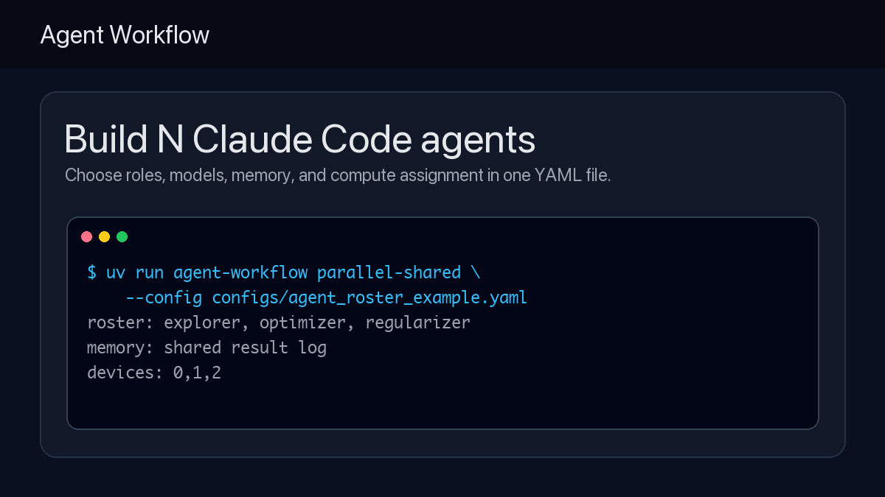
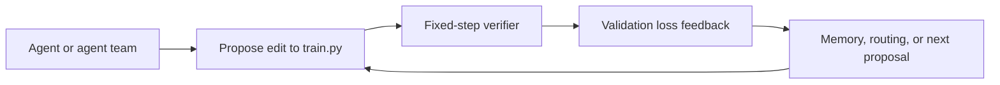
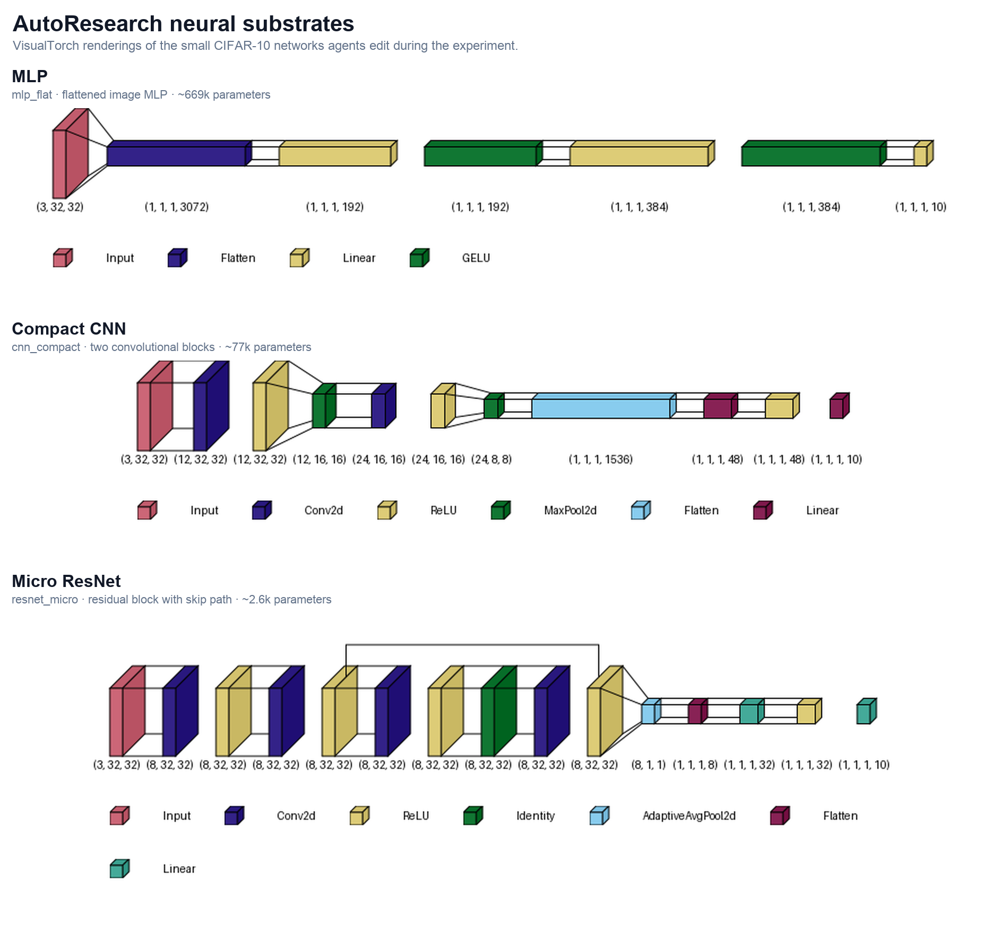
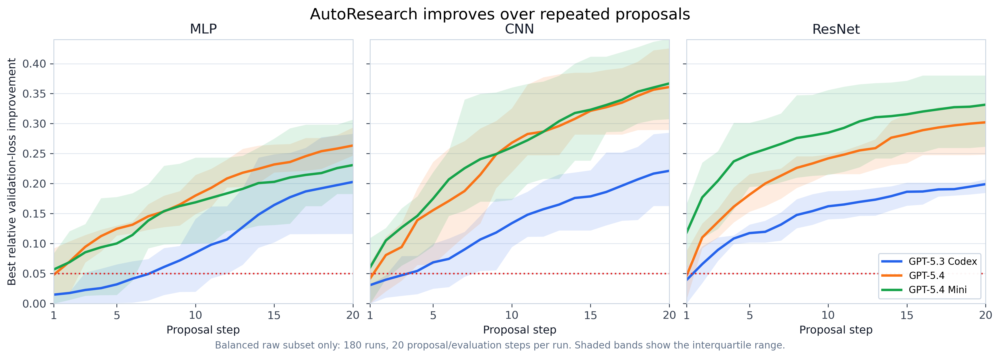
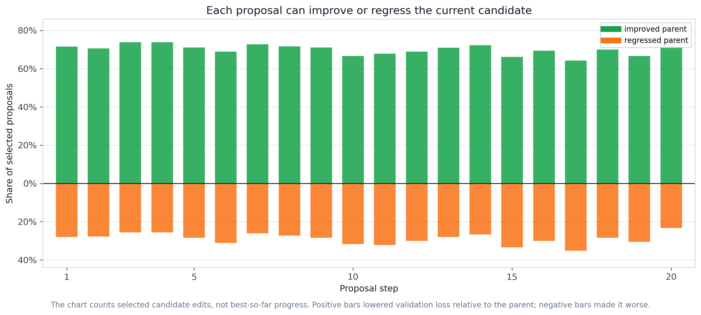
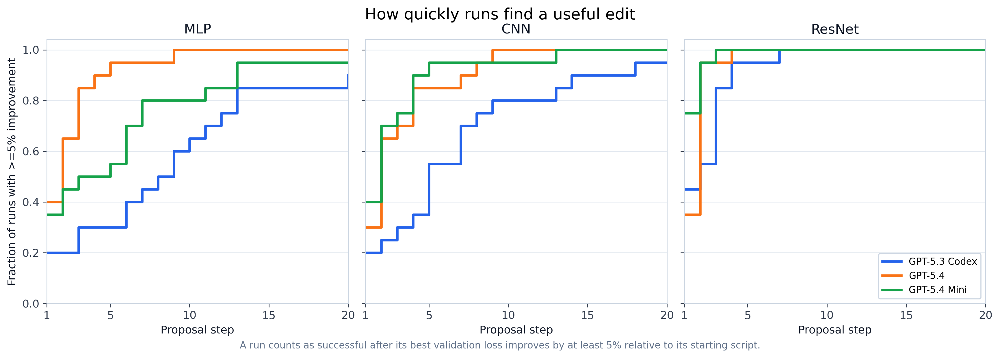
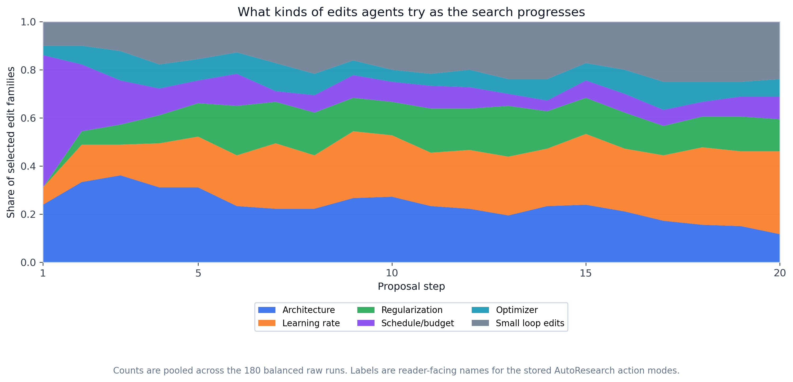

# Agent Workflow

[](https://github.com/EmaRimoldi/agent-workflow/actions/workflows/tests.yml)


Agent Workflow runs controlled AutoResearch experiments to compare how
single-agent, parallel, shared-memory, swarm, and routing architectures affect
iterative research.



The built-in task is concrete: agents edit a CIFAR-10 training script, run a
fixed-step verifier, receive validation-loss feedback, and keep proposing
changes. The repository studies how orchestration changes that search process.

The framework runs locally. Live Claude Code capacity depends on your
subscription, provider quota, rate limits, and available compute.

## Quick Start

```bash
git clone https://github.com/EmaRimoldi/agent-workflow.git
cd agent-workflow
uv run agent-workflow demo
```

The demo writes an offline evidence bundle with no Claude Code session, GPU, or
provider quota required:

```text
runs/experiment_demo_.../
  workflow_card.md
  workflow_card.json
  report.html
  trajectories.csv
  summary.json
```

Before live runs:

```bash
uv run agent-workflow doctor
```

Run a custom three-agent roster:

```bash
uv run agent-workflow parallel-shared --config configs/agent_roster_example.yaml
```

Run four similar workers from the CLI:

```bash
uv run agent-workflow parallel \
  --n-agents 4 \
  --model claude-haiku-4-5-20251001 \
  --cuda-devices 0,1,2,3 \
  --train-max-steps 1170 \
  --serialized-evaluator \
  --experiment-id four_agent_smoke
```

## Why This Exists

Agent Workflow gives each agent an isolated workspace, keeps evaluation budgets
fixed, records trajectories and snapshots, and writes comparable reports. It is
designed for developers and researchers who want to study iterative agentic
research loops without needing frontier-lab infrastructure.

The built-in benchmark is `autoresearch/`: Claude Code agents edit a CIFAR-10
`train.py`, run evaluations, and try to reduce `val_bpb` validation loss. Lower
is better.

## AutoResearch In One Loop



The public AutoResearch figures below use the 180 balanced raw traces with full
step-level coverage: `3 workloads x 3 workers x 20 runs`, each with 20
proposal/evaluation steps.



The editable substrates are intentionally small: one MLP, one compact CNN, and
one micro-ResNet. The architecture figure is generated from the actual PyTorch
modules with VisualTorch. An interactive version is available at
[`docs/assets/autoresearch/interactive-mini-network.html`](docs/assets/autoresearch/interactive-mini-network.html).



Mean best-so-far improvement rises over repeated proposals, but the curve depends
on both workload and worker.



Individual proposals are not monotonic: many lower validation loss, while others
make the current candidate worse.



The same raw traces show when each run first reaches a 5% relative
validation-loss improvement.



Agents shift among architecture, learning-rate, regularization, optimizer,
schedule, and small-loop edits as the search progresses.

Regenerate these figures from the checked-in raw traces:

```bash
uv run python scripts/plot_autoresearch_readme_figures.py
uv run --extra architecture-viz python scripts/plot_autoresearch_visualtorch_architectures.py
```

## Build Your Own Agent Team

Use YAML when each agent should have a different job:

```yaml
agents:
  use_shared_memory: true
  roster:
    - id: explorer
      role: broad architecture and hyperparameter search
      model: claude-sonnet-4-6
      temperature: 1.2  # search-style directive; Claude CLI has no native temperature flag
      cuda_device: "0"
    - id: optimizer
      role: conservative refinement of the best known candidate
      model: claude-haiku-4-5-20251001
      temperature: 0.3  # lower values ask the agent to make smaller edits
      cuda_device: "1"
```

`N` is intentionally not hardcoded. You can test as many agents as your
subscription, provider rate limits, evaluator concurrency, and local CPU/GPU
resources can support.

## How It Compares

| Approach | Main job | Spawn agents | Configure N-agent rosters | Fixed-step evaluation | Evidence bundle |
|---|---:|---:|---:|---:|---:|
| Claude Code worktree launchers | Orchestration | Yes | Manual | No | No |
| Agent template collections | Agent prompts | Yes | Varies | No | No |
| Observability dashboards | Runtime monitoring | No | No | No | Yes |
| Agent Workflow | Orchestration experiments | Yes | Yes | Yes | Yes |

Agent Workflow is not trying to replace Claude Code, agent templates, or
observability tools. It provides a reproducible substrate for comparing how
different agent-team architectures behave on the same iterative research task.

## Current Shared-Memory Signal

The strongest result so far is from the memory ablation experiment:

| Condition | Attempts | Best `val_bpb` | Mean `val_bpb` |
|---|---:|---:|---:|
| Exploratory search, no memory | 21 | 0.933 | 1.816 |
| Exploratory search, shared memory | 41 | 0.914 | 1.049 |

Across 62 agent attempts, shared memory produced a 42% lower mean `val_bpb`
than the no-memory exploratory condition. The narrow takeaway: shared memory did
not solve the task, but it made exploratory agents much less destructive on this
benchmark.

## Evidence

| Evidence | What it contains | Start here |
|---|---|---|
| Baseline calibration | The starting task is neither trivial nor impossible. | [`experiments/01_baseline/`](experiments/01_baseline/) |
| Evaluation protocol | Fixed-step deterministic evaluation avoids hardware-dependent conclusions. | [`experiments/02_evaluation_protocol_calibration/`](experiments/02_evaluation_protocol_calibration/) |
| Memory ablation | Shared memory can stabilize exploratory agents in this substrate. | [`experiments/03_agent_memory_ablation/`](experiments/03_agent_memory_ablation/) |
| Swarm baseline | Historical blackboard runs are promising context for richer coordination. | [`experiments/04_swarm_baselines/`](experiments/04_swarm_baselines/) |
| AutoResearch routing | Imported processed routing/accounting results from the NeurIPS workspace. | [`experiments/05_autoresearch_model_routing/`](experiments/05_autoresearch_model_routing/) |
| SWE-bench scaffold | Neutral study inputs and orchestration code, without historical results. | [`experiments/06_swebench_experimental_scaffold/`](experiments/06_swebench_experimental_scaffold/) |

## CLI

```bash
uv run agent-workflow --help
uv run agent-workflow parallel --help
uv run agent-workflow parallel-shared --help
uv run agent-workflow single-long --help
uv run agent-workflow single-memory --help
uv run agent-workflow swarm --help
uv run agent-workflow merge --help
uv run agent-workflow certified-time --help
uv run agent-workflow baseline-calibration --help
uv run agent-workflow doctor
uv run agent-workflow demo
```

Live agent runs require Claude Code authentication and a clean workspace. See
[`docs/reproducibility.md`](docs/reproducibility.md).

## What Is Included

- A runnable `agent-workflow` CLI.
- An offline `agent-workflow demo` command that generates a reviewable evidence
  bundle without Claude Code, GPU, or provider quota.
- Static `report.html` and `workflow_card` artifacts for fast run review.
- Configurable agent rosters for custom roles, models, temperatures, and device
  assignment.
- Claude Code project instructions, sub-agent templates, and a preflight
  `doctor` command.
- The controlled `autoresearch/` benchmark task.
- Execution modes for single-agent, parallel, shared-memory, swarm, and merge
  workflows.
- Shared-memory/blackboard primitives, certified-time analysis, diversity
  metrics, snapshots, reasoning traces, and reporting utilities.
- Curated experiment summaries, tables, and figures.

## Limits

- This is not a general benchmark for all agent tasks.
- The current strongest evidence is one controlled memory-ablation comparison.
- Historical live-agent runs are not bit-for-bit reproducible because model
  services and agent decisions can change over time.

## More

- [`docs/index.html`](docs/index.html) - minimal GitHub Pages landing page
- [`docs/demo.md`](docs/demo.md) - offline demo command and generated artifacts
- [`docs/launch/`](docs/launch/) - launch checklist and copy
- [`experiments/README.md`](experiments/README.md) - experiment map
- [`experiments/reproducibility.md`](experiments/reproducibility.md) - per-experiment rerun commands and limitations
- [`experiments/catalog.md`](experiments/catalog.md) - compact evidence catalog
- [`docs/reviewer_checklist.md`](docs/reviewer_checklist.md) - what is built, proven, and still open
- [`docs/reproducibility.md`](docs/reproducibility.md) - local and Claude Code setup
- [`docs/product/claude_code_orchestration.md`](docs/product/claude_code_orchestration.md) - product wedge and Claude Code orchestration setup
- [`docs/product/positioning.md`](docs/product/positioning.md) - launch positioning, naming risk, and benchmark roadmap
