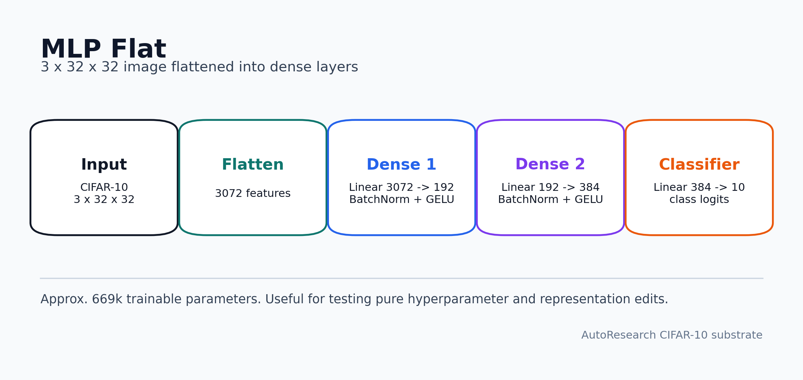
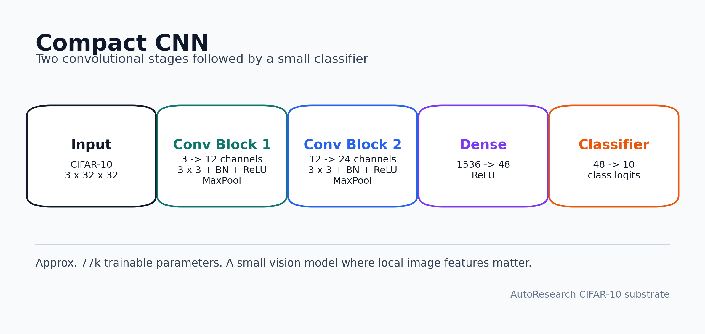
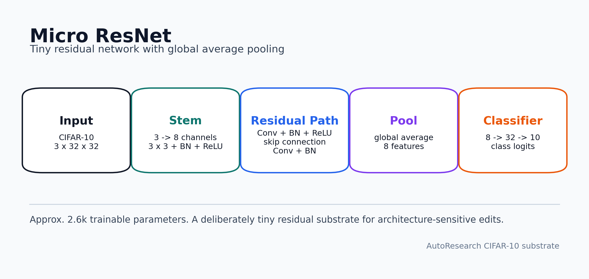
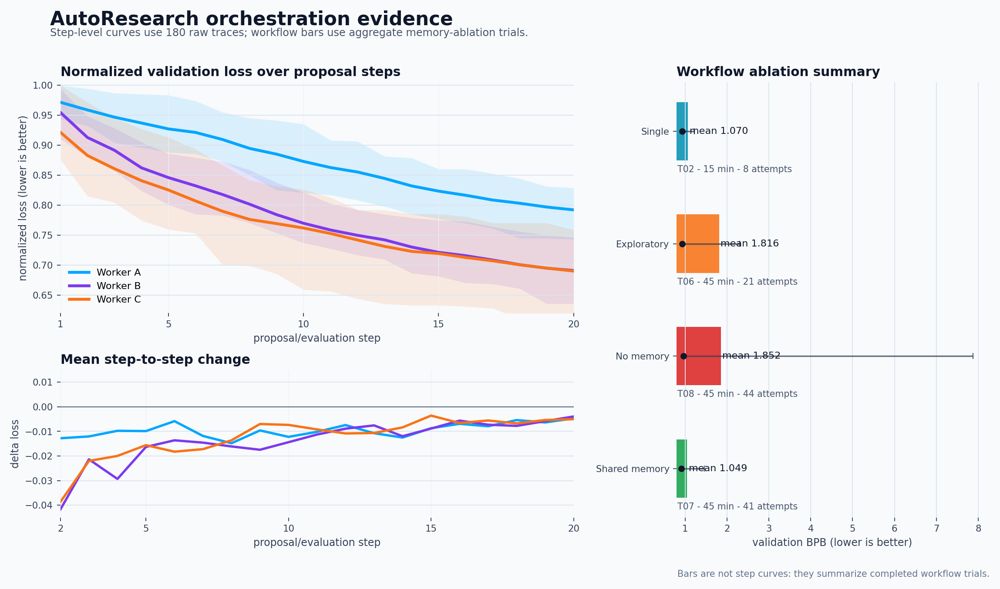

# AutoResearch Orchestration

[](https://github.com/EmaRimoldi/agent-workflow/actions/workflows/tests.yml)


Run AutoResearch experiments that compare single agents, parallel agents,
shared memory, swarms, and model routing on the same iterative research task.


The benchmark is concrete: an agent edits a CIFAR-10 training program, receives
validation-loss feedback, and proposes the next edit. The question is how the
orchestration around that loop changes the search.

## Quick Start

```bash
git clone https://github.com/EmaRimoldi/agent-workflow.git
cd agent-workflow
uv run agent-workflow demo
```

The demo is offline. It writes a small evidence bundle without Claude Code, GPU,
or provider quota:

```text
runs/experiment_demo_.../
  workflow_card.md
  workflow_card.json
  report.html
  trajectories.csv
  summary.json
```

Before live runs:

```bash
uv run agent-workflow doctor
```

Run a configurable shared-memory team:

```bash
uv run agent-workflow parallel-shared --config configs/agent_roster_example.yaml
```

Run four workers from the CLI:

```bash
uv run agent-workflow parallel \
  --n-agents 4 \
  --model claude-haiku-4-5-20251001 \
  --cuda-devices 0,1,2,3 \
  --train-max-steps 1170 \
  --serialized-evaluator \
  --experiment-id four_agent_smoke
```

The public package name and CLI remain `agent-workflow` for install and script
compatibility; the project framing is AutoResearch Orchestration.

## What The Task Is

AutoResearch is a fixed iterative-research loop over a small CIFAR-10 training
program:

1. Start from a calibrated `train.py`.
2. Ask an agent or agent team to propose an edit.
3. Run a fixed-step verifier.
4. Report validation BPB back to the agent.
5. Repeat for a fixed proposal horizon.

`val_bpb` means validation bits per byte. Lower is better. The fixed-step
verifier matters because wall-clock training budgets can accidentally measure
CPU/GPU contention instead of agent quality.

## Neural Substrates

The experiments use three deliberately small CIFAR-10 networks. They are small
enough to evaluate repeatedly and different enough to expose whether an agent is
learning useful workload-specific edits.







Regenerate the architecture diagrams:

```bash
uv run python scripts/plot_autoresearch_neural_substrates.py
```

## Step-Level AutoResearch Results

The figure below uses the 180 balanced raw traces with complete step-level
coverage: `3 workloads x 3 workers x 20 runs`, each with 20 proposal/evaluation
steps.


Mean best-so-far improvement rises over repeated proposals, but the trajectory
depends on both workload and worker.


Individual proposals are not monotonic. Some edits improve validation loss;
others regress, and the useful signal is the cumulative search path over many
steps.

Regenerate the step-level figures from checked-in raw traces:

```bash
uv run python scripts/plot_autoresearch_readme_figures.py
uv run python scripts/plot_product_evidence_assets.py
```

## Orchestration Results

The memory-ablation experiment compares different workflow structures on the
same AutoResearch substrate. These are aggregate trial summaries, not per-step
trajectories.

| Workflow | Trial | Budget | Attempts | Best `val_bpb` | Mean `val_bpb` | Interpretation |
| --- | --- | ---: | ---: | ---: | ---: | --- |
| Single agent | `T02` | 15 min | 8 | 0.936 | 1.070 | Useful control: one agent can find good edits, but with low search breadth. |
| Exploratory, no shared memory | `T06` | 45 min | 21 | 0.933 | 1.816 | Direct no-memory comparison for the shared-memory trial. |
| Two agents, no shared memory | `T08` | 45 min | 44 | 0.961 | 1.852 | More attempts did not guarantee better quality; exploratory agents produced large regressions. |
| Two agents, shared memory | `T07` | 45 min | 41 | 0.914 | 1.049 | Shared memory gave the strongest aggregate trial: lower best loss and much lower mean loss. |

The strongest narrow result so far is the matched exploratory comparison:
shared memory (`T07`) versus no memory (`T06`). It does not prove that
multi-agent systems always win; it shows that, on this controlled task, shared
state can make exploratory agent search less destructive.



## Build Your Own Agent Team

Use YAML when each agent should have a different role, model, or device:

```yaml
agents:
  use_shared_memory: true
  roster:
    - id: explorer
      role: broad architecture and hyperparameter search
      model: claude-sonnet-4-6
      temperature: 1.2  # search-style directive; Claude CLI has no native temperature flag
      cuda_device: "0"
    - id: optimizer
      role: conservative refinement of the best known candidate
      model: claude-haiku-4-5-20251001
      temperature: 0.3  # lower values ask the agent to make smaller edits
      cuda_device: "1"
```

`N` is not hardcoded. You can test as many agents as your subscription, provider
rate limits, evaluator concurrency, and local CPU/GPU resources can support.

## Evidence Map

| Evidence | What it contains | Start here |
| --- | --- | --- |
| Baseline calibration | The starting task is neither trivial nor impossible. | [`experiments/01_baseline/`](experiments/01_baseline/) |
| Evaluation protocol | Fixed-step deterministic evaluation avoids hardware-dependent conclusions. | [`experiments/02_evaluation_protocol_calibration/`](experiments/02_evaluation_protocol_calibration/) |
| Memory ablation | Single-agent, no-memory, and shared-memory workflow comparisons. | [`experiments/03_agent_memory_ablation/`](experiments/03_agent_memory_ablation/) |
| Swarm baselines | Historical two-agent blackboard runs and independent parallel baselines. | [`experiments/04_swarm_baselines/`](experiments/04_swarm_baselines/) |
| AutoResearch routing | Processed model-routing/accounting results plus 180 balanced raw traces. | [`experiments/05_autoresearch_model_routing/`](experiments/05_autoresearch_model_routing/) |
| SWE-bench scaffold | Future orchestration inputs and code scaffold, without completed results. | [`experiments/06_swebench_experimental_scaffold/`](experiments/06_swebench_experimental_scaffold/) |

## CLI

```bash
uv run agent-workflow --help
uv run agent-workflow parallel --help
uv run agent-workflow parallel-shared --help
uv run agent-workflow single-long --help
uv run agent-workflow single-memory --help
uv run agent-workflow swarm --help
uv run agent-workflow merge --help
uv run agent-workflow certified-time --help
uv run agent-workflow baseline-calibration --help
uv run agent-workflow doctor
uv run agent-workflow demo
```

Live agent runs require Claude Code authentication and a clean workspace. See
[`docs/reproducibility.md`](docs/reproducibility.md).

## Limits

- This is an AutoResearch orchestration benchmark, not a universal agent score.
- Historical live-agent runs are not bit-for-bit reproducible because model
  services and agent decisions can change over time.
- The step-level routing curves and the memory-ablation workflow table come
  from different evidence sets; the README keeps them separate.

## More

- [`docs/demo.md`](docs/demo.md) - offline demo command and generated artifacts
- [`docs/reproducibility.md`](docs/reproducibility.md) - setup, Claude Code, and rerun commands
- [`experiments/README.md`](experiments/README.md) - experiment map
- [`experiments/reproducibility.md`](experiments/reproducibility.md) - per-experiment rerun commands
- [`experiments/catalog.md`](experiments/catalog.md) - compact evidence catalog
- [`docs/reviewer_checklist.md`](docs/reviewer_checklist.md) - what is built, proven, and still open
