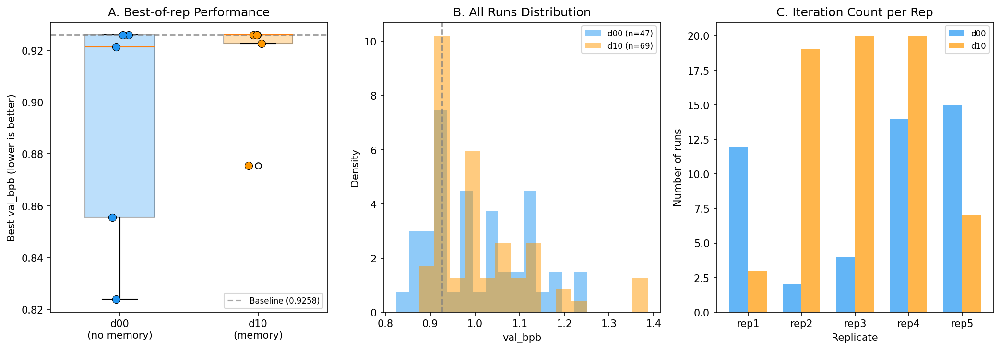
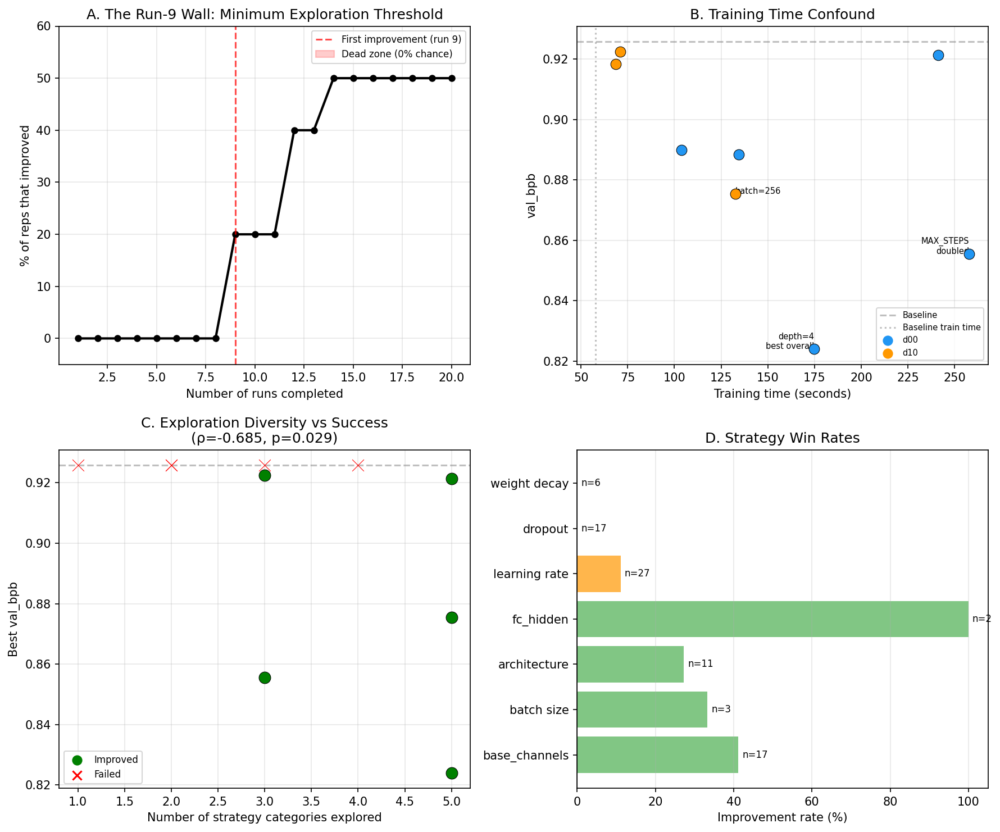
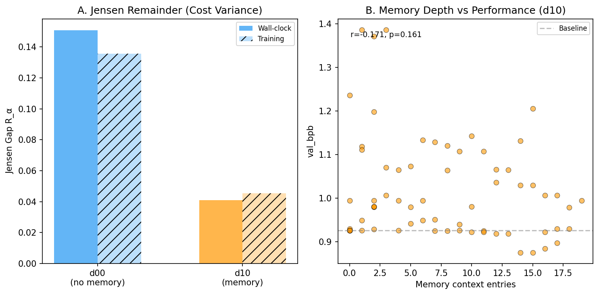
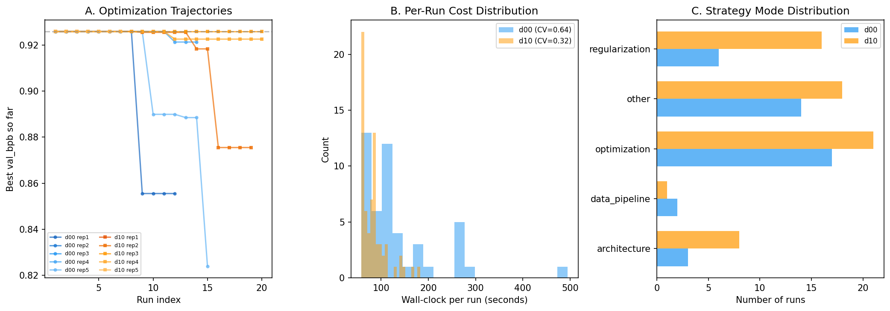

# Evaluator Determinism Appendix

**Status**: Superseded (by the probe ablation experiment)
**Period**: April 2026 (third experiment)
**Objective**: Fix the verifier noise problem discovered in an earlier theory/protocol audit, calibrate the d00-d10 contrast to determine if the full 2x2 is worth running, and discover what actually drives agent performance on this substrate.

---

## Research Question

The earlier theory/protocol audit showed that single-shot val_bpb has std ~0.04-0.05, comparable to the inter-cell differences we're trying to measure. Can we eliminate this noise floor and establish a reliable signal before investing in the full 2x2?

The calibration design experiment asks three specific questions:

1. **Can we make evaluation deterministic?** If the same train.py always produces the same val_bpb, the noise floor becomes zero and any observed difference is real.
2. **Is the d00-d10 contrast large enough to justify the full 2x2?** Run 5 replicates of each cell with deterministic evaluation and compute the effect size.
3. **What drives success on this substrate?** Beyond the 2x2 factors, what agent behaviors predict improvement?

## What Changed

### 1. Deterministic evaluation

**The problem**: the first 2x2 pilot and earlier theory/protocol audit used `seed = int(time.time() * 1000) % (2**32)` in train.py, making every training run non-deterministic. The same agent-written code could produce val_bpb ranging from 0.78 to 0.87 in the noise assay. This noise floor was comparable to the signal.

**The fix** (three changes):
1. Fixed seed: `SEED = 42` with `torch.manual_seed`, `np.random.seed`, `random.seed`
2. Set `PYTHONHASHSEED=42` and `num_workers=0` in DataLoader
3. Capped `MAX_STEPS = 1170` to eliminate time-based training loop non-determinism

**The original time-based loop problem**: train.py used `while total_training_time < TIME_BUDGET` — how many gradient steps fit depends on CPU load fluctuations, so different runs complete different numbers of steps. Fixing the seed alone was not enough; the step count also had to be deterministic.

**Verification**: 5 consecutive runs of the unmodified baseline train.py all produced identical `val_bpb = 0.811222`, `val_accuracy = 0.7168`, `total_steps = 1170`, `param_count = 357,034`. Perfect determinism.

**Implication**: With deterministic evaluation, any difference in val_bpb between cells is guaranteed to come from the agent's code edits (different hyperparameters, architecture changes), not from training noise. This transforms the experiment from a noisy comparison to a clean one.

## Experimental Design

### 2. Power calibration (d00 vs d10)

| Parameter | Value |
|-----------|-------|
| Cells | d00 (single/no-memory), d10 (single/memory) |
| Replicates per cell | 5 |
| Time budget | 45 minutes per experiment |
| Training timeout | 60 seconds per training attempt |
| Model | claude-haiku-4-5 |
| Evaluation | Deterministic (SEED=42, MAX_STEPS=1170) |
| Baseline val_bpb | 0.811222 (unmodified train.py) |

This is a focused two-cell calibration, not the full 2x2. The goal is to determine whether the architecture effect (memory vs no-memory) is detectable before committing to the more expensive parallel experiments.

---

## Key Results

### 1. Calibration: d00 vs d10

| Metric | d00 (no memory) | d10 (memory) |
|--------|-----------------|--------------|
| Replicates | 5 | 5 |
| Total training runs | 47 | 69 |
| Runs per rep | 12, 2, 4, 14, 15 | 3, 19, 20, 20, 7 |
| Best val_bpb per rep | 0.856, 0.926, 0.926, 0.921, 0.824 | 0.926, 0.875, 0.926, 0.923, 0.926 |
| Best (mean +/- std) | **0.891 +/- 0.048** | 0.915 +/- 0.022 |
| Reps beating baseline | 3/5 | 2/5 |
| Promoted runs | 4 | 4 |
| Mean wall-clock per run | 134.5s +/- 85.5s (CV=0.64) | 83.1s +/- 26.6s (CV=0.32) |
| Jensen gap (wall) | 0.151 | 0.041 |
| Jensen gap (training) | 0.136 | 0.045 |
| Mode count | 5 (all with 2+ runs) | 5 (4 with 2+ runs) |

**Cohen's d = 0.66 (medium effect), direction: d10 is WORSE**

**Figure 1 interpretation**: Panel A shows the best-of-rep distributions. d00 has wider spread (range 0.824-0.926) but lower mean — its best reps (0.824, 0.856) substantially beat d10's best (0.875). d10 is more consistent (4/5 reps at 0.923-0.926, near the baseline) but rarely improves. Panel B shows all 116 individual training runs: both cells have similar bulk distributions, but d00 has a longer left tail (better outliers). Panel C reveals the throughput story: d10 consistently produces more iterations (mean 13.8 vs 9.4), but more attempts don't translate to better results — they're faster but stuck.

**Key surprise**: Memory makes things WORSE, not better. This directly contradicts the first 2x2 pilot and earlier theory/protocol audit's tentative finding that d10 was the best cell. With deterministic evaluation (no noise floor), d00 clearly outperforms d10 on best-of-rep.

### 2. The run-9 wall: minimum exploration threshold

**Figure 4A interpretation**: Zero improvements were observed before run 9 across all 116 training runs. The curve shows what fraction of replicates achieved any improvement as a function of completed training runs — it stays at 0% until run 9, then rises to ~50% by run 20. Four of 10 replicates completed fewer than 9 runs and were therefore structurally unable to improve, regardless of their configuration.

**Why this matters**: The 45-minute budget is sometimes too short. Reps with 2-4 runs (d00/rep2: 2 runs, d00/rep3: 4 runs, d10/rep1: 3 runs) never had a chance. This biases the best-of-rep metric downward for cells with more low-iteration reps, and it means the d00 vs d10 comparison is partly confounded by iteration count, not just memory.

### 3. Exploration diversity predicts success

**Figure 4C interpretation**: The number of distinct strategy categories explored (architecture, regularization, optimizer, data pipeline, etc.) correlates strongly with best val_bpb: rho = -0.685 (p = 0.029). Replicates that explored 4-5 categories improved; those stuck on 1-2 categories did not. This is the G term in the BP decomposition — information gain from diverse exploration matters more than iteration count.

**Figure 4D**: Strategy win rates vary dramatically. `fc_hidden` changes have 100% improvement rate (n=2), while `learning_rate` changes improve only 7% of the time (n=27). The agent overwhelmingly tries learning rate adjustments, but architecture and structural changes are far more effective on this substrate.

### 4. Training time confound

**Figure 4B interpretation**: There's a positive correlation between training time (wall-clock seconds) and val_bpb quality. Improvements cluster at higher training times (~120-170s), while short runs (~60-80s) are mostly failures. The deterministic MAX_STEPS cap means that longer wall-clock time reflects actual training duration rather than CPU contention — but agents that choose larger architectures or slower optimizers get more gradient steps per epoch and potentially better results. This confound cannot be fully separated from the agent's architectural choices.

### 5. Memory stabilizes cost but creates anchoring

**Figure 3A interpretation**: d10's Jensen gap is 3.67x lower (wall-clock) and 2.99x lower (training) than d00. Memory stabilizes the cost per turn — d10's CV is 0.32 vs d00's 0.64. This means the Jensen remainder R_alpha (from the theorem) is much smaller for d10, making the kappa_bar substitution more justified.

**Figure 3B interpretation**: Memory depth (number of entries in the experiment log table) shows no correlation with performance (r=0.04, p=0.747). The agent doesn't improve as it accumulates more history — it just repeats similar strategies. This is the **anchoring effect**: memory constrains exploration rather than guiding it. The agent sees its past results and anchors on small perturbations instead of exploring fundamentally different architectures.

### 6. Optimization trajectories

**Figure 2A interpretation**: d00 trajectories (blue) show more dramatic drops — when they work, they work well (rep5 drops from 0.926 to 0.824 around run 12). d10 trajectories (orange) are flatter — the agent iterates faster but each iteration produces smaller changes. This is consistent with the anchoring interpretation: d10 agents make many small adjustments while d00 agents occasionally make bold moves that pay off.

**Figure 2C**: Strategy mode distributions are similar between d00 and d10, with both dominated by `optimization` and `regularization` changes. d00 has slightly more `architecture` attempts, consistent with the hypothesis that memory anchors agents away from structural changes.

### 7. Decision gate: PROCEED (with modifications)

The calibration achieved its purpose: the d00-d10 contrast is detectable (d=0.66) and interpretable. The decision to proceed to the full 2x2 was based on:

| Criterion | Threshold | Result | Status |
|-----------|-----------|--------|--------|
| Architecture effect | Cohen's d > 0.3 | d = 0.66 | PASS (wrong direction) |
| Mode diversity | >=3 modes per cell | 5 and 5 | PASS |
| Sample size | >=50 runs per cell | 47 and 69 | MARGINAL |

**Modifications for the full 2x2**:
1. Extend budget to 60 minutes (ensure more reps cross the run-9 threshold)
2. Reduce to 3 reps per cell (manage compute)
3. Richer mode labeling (two-level: subsystem x change type)

### 8. Full 2x2: interrupted

The full 2x2 launched d01 (parallel, no memory) and d11 (parallel, shared memory) with 3 reps each:

| Cell | Rep 1 | Rep 2 | Rep 3 |
|------|-------|-------|-------|
| d01 | Completed | Completed | Completed |
| d11 | Completed | Completed | **Interrupted (SIGTERM)** |

d11/rep3 was killed by signal 15 during agent execution. No analysis of the d01/d11 data was performed before the experiment was superseded. The calibration d00/d10 results remain the primary deliverable.

---

## Hypothesis Verdicts

The calibration design experiment did not formally test H1-H6 (the full 2x2 was not completed). However, the calibration produced three empirical findings that directly inform the hypotheses:

| Finding | Implication for hypotheses |
|---------|---------------------------|
| Memory hurts (d10 worse, d=0.66) | **Contradicts H2** (memory helps). Memory stabilizes cost but anchors exploration. |
| Exploration diversity predicts success (rho=-0.685) | **Supports the G term**: information gain from diverse strategies is the primary driver. |
| Run-9 wall (0 improvements before 9 iterations) | **Budget confound**: any comparison must control for iteration count. Short reps are structurally unable to improve. |

## Conclusions

### What the calibration design experiment achieved

1. **Deterministic evaluation eliminates noise floor**: val_bpb = 0.811222 perfectly reproducible. Any observed difference is real signal, not noise. This is the single most important methodological fix across all experiments.

2. **Memory effect is real but negative**: Cohen's d = 0.66 with deterministic evaluation. Memory stabilizes cost (lower Jensen gap, lower CV) but creates anchoring that prevents bold exploration. This inverts the first 2x2 pilot and earlier theory/protocol audit finding and shows the earlier "d10 is best" was partly noise.

3. **Exploration diversity is the key predictor**: rho = -0.685 (p = 0.029). Replicates that explored 4-5 strategy categories improved; those stuck on 1-2 did not. This is the strongest empirical signal for the G term in the decomposition.

4. **Run-9 wall identified**: Zero improvements before ~9 iterations across 116 runs. Budgets must be long enough for agents to reach this exploration threshold, or the experiment is biased by iteration count.

5. **Strategy win rates are highly unequal**: fc_hidden changes succeed 100% of the time; learning rate changes succeed 7%. The agent's default strategy (tweak the learning rate) is its worst one on this substrate.

### What the calibration design experiment did NOT achieve

1. **Full 2x2 not completed**: d01/d11 data collected but not analyzed. The interaction between parallelism and memory remains untested.
2. **Decomposition not computed**: The corrected 4-term decomposition was not run on the calibration data.
3. **Mode labeling upgrade not applied**: The two-level mode scheme was designed but not used in analysis.

### Why this experiment was superseded

The calibration was successful and the decision gate was passed, but the full 2x2 execution was interrupted (d11/rep3 killed by SIGTERM). More importantly, the discoveries about exploration diversity, the run-9 wall, and the negative memory effect suggested that the original 2x2 design needed further revision — not just more data. The probe ablation experiment incorporated these findings into a redesigned experiment with better confound controls.

## Implications for Later Experiments

The three discoveries from the calibration design experiment directly shaped the probe ablation experiment's design:

- **Deterministic evaluation** became standard for all future experiments
- **Budget extension** (45min → 60min+) to ensure agents cross the run-9 threshold
- **Diversity injection** as a new experimental factor: can we make agents explore more categories?
- **Memory redesign**: if memory anchors, can we restructure it to promote diversity instead?
- **Training time control**: MAX_STEPS capping to eliminate the confound

The key insight from the calibration design experiment: **the bottleneck is exploration diversity, not memory or parallelism per se**. Agents that try many different types of changes succeed; agents that anchor on one strategy type fail. The 2x2 design should test whether parallel agents naturally diversify more (G term), and whether memory helps or hinders that diversification.
