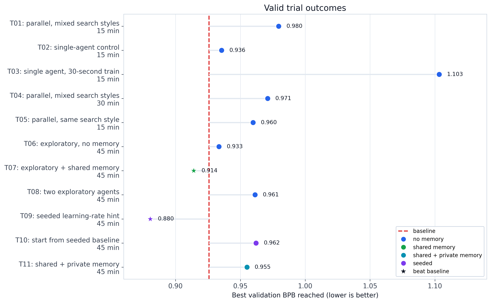
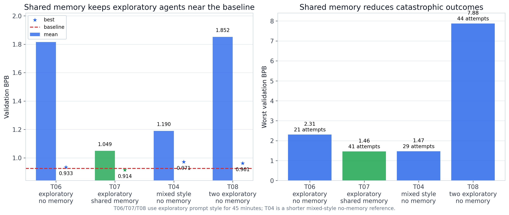
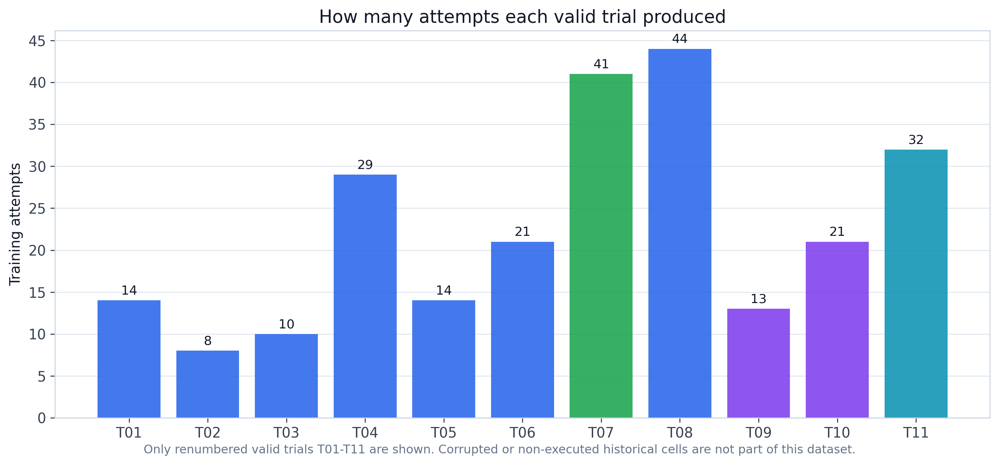

# Agent Memory Ablation

**Status**: active evidence experiment
**Period**: April 2026
**Question**: when agents explore aggressively, does shared memory make their
search more reliable?

## Task

Each trial runs Claude Haiku agents on the AutoResearch CIFAR-10 task. Agents
edit one training script, launch short training attempts, and try to lower
validation BPB.

In this runtime, `val_bpb` is the validation-loss value parsed by the existing
agent framework. Lower is better. The deterministic baseline to beat in this
experiment is `val_bpb = 0.925845`.

This baseline matters because the task is intentionally hard but not impossible:
the starting script is already strong, so most edits make it worse. A useful
agent workflow should avoid repeated harmful edits, not merely generate many
attempts.

## Trial Set

The public experiment uses 11 valid trials, renumbered `T01` through `T11`. Corrupted
or non-executed historical cells were removed before renumbering.

| Trial | Condition | Memory | Attempts | Best `val_bpb` | Mean `val_bpb` |
| --- | --- | --- | ---: | ---: | ---: |
| `T01` | parallel, mixed search styles | none | 14 | 0.980 | 1.136 |
| `T02` | single-agent control | none | 8 | 0.936 | 1.070 |
| `T03` | single agent, 30-second train | none | 10 | 1.103 | 1.447 |
| `T04` | parallel, mixed search styles | none | 29 | 0.971 | 1.190 |
| `T05` | parallel, same search style | none | 14 | 0.960 | 1.090 |
| `T06` | exploratory, no memory | none | 21 | 0.933 | 1.816 |
| `T07` | exploratory + shared memory | shared | 41 | 0.914 | 1.049 |
| `T08` | two exploratory agents | none | 44 | 0.961 | 1.852 |
| `T09` | seeded learning-rate hint | none | 13 | 0.880 | 1.501 |
| `T10` | start from seeded baseline | none | 21 | 0.962 | 1.216 |
| `T11` | shared + private memory | shared and private | 32 | 0.955 | 1.064 |

## Workflow Conditions

The trials vary four workflow choices:

- one agent vs two parallel agents;
- no memory, private memory, shared memory, or both;
- conservative/default/exploratory search style;
- seeded learning-rate hints vs no seeded hint.

**No memory** means the agent sees the current task prompt and workspace only.

**Private memory** means the agent receives a summary of its own previous
attempts. It is agent-local: another agent cannot read it.

**Shared memory** means parallel agents write to and read from the same
append-only results log. It acts like a small blackboard: failed edits,
successful edits, and best observed metrics can be visible to both agents.

The historical configs used the word `temperature`, but the current Claude CLI
does not expose a real sampling-temperature flag. In this repo, values such as
`0.3`, `1.2`, or `1.5` are implemented as **prompt-level search-style
directives**: low values ask for conservative edits, high values ask for broader
exploration, and `null` leaves Claude at default behavior.

## Main Result

The clearest comparison is `T06` vs `T07`:

| Trial | Condition | Attempts | Best `val_bpb` | Mean `val_bpb` | Worst `val_bpb` |
| --- | --- | ---: | ---: | ---: | ---: |
| `T06` | exploratory search, no memory | 21 | 0.933 | 1.816 | 2.305 |
| `T07` | exploratory search, shared memory | 41 | 0.914 | 1.049 | 1.462 |

The interpretation is narrow but important: shared memory did not solve the
task, but it kept exploratory agents from repeatedly damaging the solution. In
this substrate, shared memory acts mostly as variance reduction and failure
avoidance.

`T11` tested shared plus private memory and did not improve over `T07`. That
suggests private memory is not automatically useful here; it may constrain
exploration or duplicate information already present in the shared log.

## Figures

**Figure 1**: best validation BPB reached by each valid trial. Stars beat the
baseline.

**Figure 2**: the core result. With exploratory search, `T07` stays much closer
to the baseline than no-memory controls and avoids the worst regressions.

**Figure 3**: how many training attempts each valid trial produced.

## Important Caveats

This is a probing experiment, not a confirmatory benchmark. Each trial has one
execution, so results are best read as signal detection.

The raw live-agent run directories and original historical configs are not
included in this public tree. The tracked evidence is the canonical trial
table, statistical summary, and generated figures under `results/`.

## Evidence Files

- `results/trial_index.md`: compact table of the valid `T01`-`T11` trials.
- `results/trial_results.json`: machine-readable canonical trial metrics.
- `results/statistical_summary.md`: clean run-level comparisons used in the
  public narrative.
- `results/figures/`: generated PNG/PDF figures.
- `../../scripts/plot_agent_memory_ablation.py`: public figure generator.
