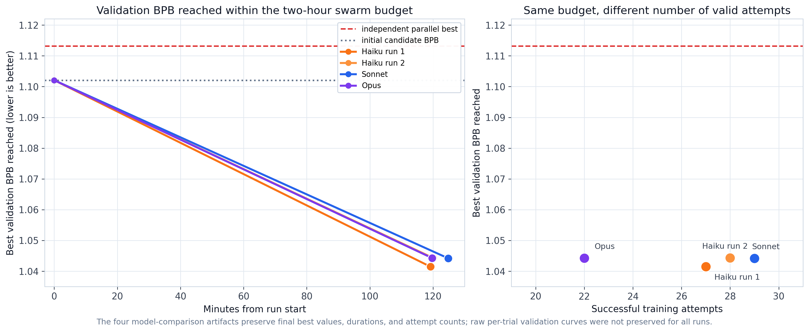
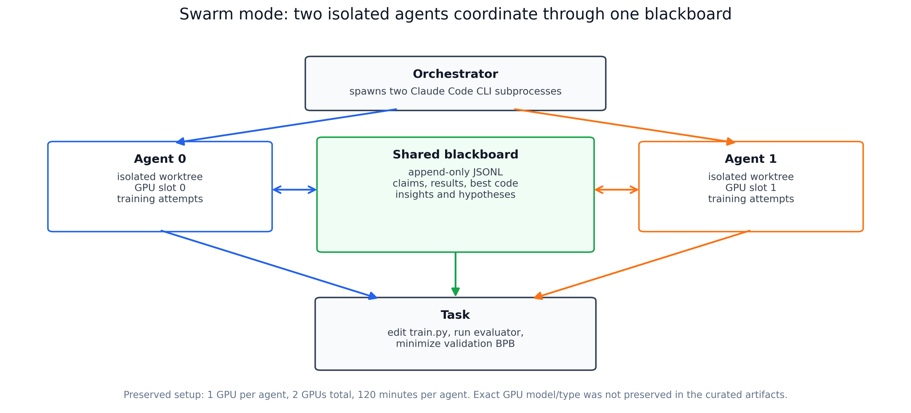
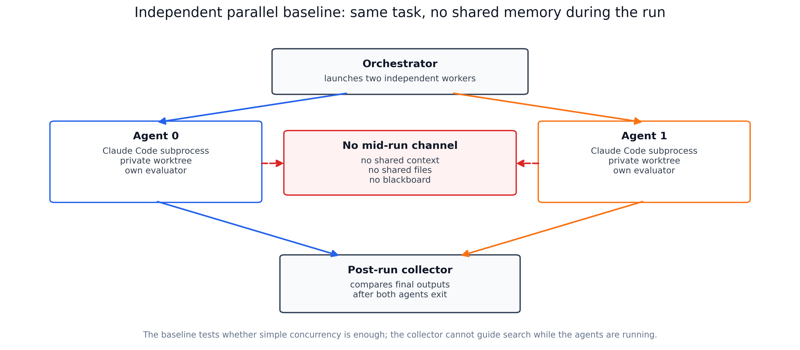

# Swarm Baselines

**Status**: historical evidence experiment
**Period**: April 2026
**Question**: does explicit shared memory help two code-editing agents search
better than two independent agents running in parallel?

## Task

The task is AutoResearch. Each agent uses the Claude Code CLI to edit
`train.py`, launch a bounded training attempt, read the resulting validation
BPB, and keep searching for code edits that lower validation BPB. Lower
`val_bpb` means a better candidate.

The swarm variant gives two isolated agents a shared blackboard. Agents can
publish claims, results, best code, insights, and hypotheses while the run is
still active. The independent-parallel baseline launches two agents on the same
task but lets them communicate only after both processes finish.

## What Was Run

The preserved model-comparison runs contain four two-agent swarm experiments:

- Haiku 4.5 run 1: 27 successful training attempts in 119.2 minutes, best
  `val_bpb = 1.041477`.
- Haiku 4.5 run 2: 28 successful training attempts in 120.0 minutes, best
  `val_bpb = 1.044341`.
- Sonnet 4.6: 29 successful training attempts in 124.8 minutes, best
  `val_bpb = 1.044216`.
- Opus 4.6: 22 successful training attempts in 119.7 minutes, best
  `val_bpb = 1.044304`.

Each swarm run used 2 agents, 120 minutes per agent, 300 seconds per training
attempt, and 1 GPU per agent, for 2 GPUs total. The exact GPU model/type is not
preserved in the curated artifacts.

The phrase "106 successful runs" in the archived material means 106 valid
training attempts across those four swarm experiments. It does not mean 106
separate experiments.

## Main Results

The strongest preserved comparison is simple: independent parallelization
reached `val_bpb = 1.113130`, while the two Haiku swarm runs reached
`1.041477` and `1.044341`.

The model-comparison runs also show that Haiku, Sonnet, and Opus ended in a
tight quality band around `1.041-1.044`. Opus completed fewer attempts in the
same wall-clock budget, which makes its similar final quality useful but not
evidence that Opus was a more efficient search worker in this setup.

## Figures

**Figure 1**: best validation BPB reached by the preserved swarm runs under the
two-hour budget. The plot uses final best values, durations, and attempt counts
from the preserved summaries; full per-trial validation curves are not
available for all four runs.

**Figure 4**: swarm mode launches two isolated Claude Code workers, gives each
one its own workspace and GPU slot, and coordinates search through a shared
JSONL blackboard.

**Figure 5**: independent parallel mode launches two isolated workers without a
shared channel during the run. The collector compares outputs only after both
agents finish.

## How Agents Were Spawned

The current implementation launches each agent as an isolated Python subprocess.
Inside that subprocess, the agent is invoked through the Claude Code CLI using
`claude --print`.

- Independent parallel mode creates one isolated workspace per agent, launches
  all agents simultaneously, and collects results after completion.
- Swarm mode also creates one isolated workspace per agent, then installs the
  coordinator tools and a `.swarm_env` file pointing to the shared blackboard.
- The blackboard is an append-only JSONL file. Writes use exclusive `fcntl`
  locks; reads use shared locks, so concurrent agents do not corrupt the file.

Implementation references:

- parallel process spawning: `src/agentops_lab/orchestrator.py`;
- independent agent subprocess wrapper:
  `src/agentops_lab/agents/isolated_agent_process.py`;
- Claude Code invocation: `src/agentops_lab/swarm/claude_agent_runner.py`;
- swarm orchestrator: `src/agentops_lab/swarm/swarm_orchestrator.py`;
- blackboard implementation: `src/agentops_lab/swarm/shared_memory.py`;
- workspace blackboard tool installation: `src/agentops_lab/swarm/workspace.py`.

## Evidence Files

- `results/figures/`: public figures generated by
  `scripts/plot_swarm_baselines.py`.
- `results/analysis/haiku_swarm_run_1_deep_dive/`: detailed visual analysis for
  one historical Haiku swarm run.
- `results/analysis/model_comparison/`: Haiku/Sonnet/Opus comparison summaries,
  CSV/JSON tables, and archived analysis scripts.
- `results/analysis/swarm_vs_independent_parallel/`: preserved comparison
  between the independent-parallel baseline and two Haiku swarm runs.

## Completeness

This is a useful historical evidence bundle, not a complete reproducibility
bundle. The curated summaries, CSV/JSON result tables, scripts, and figures are
preserved. The raw `results/swarm/runs/` directories were not present when the
artifacts were moved, so some archived scripts document provenance but cannot be
rerun inside this folder without restoring those raw runs.

Treat the result as design evidence for blackboard coordination, not as a final
confirmatory benchmark.
