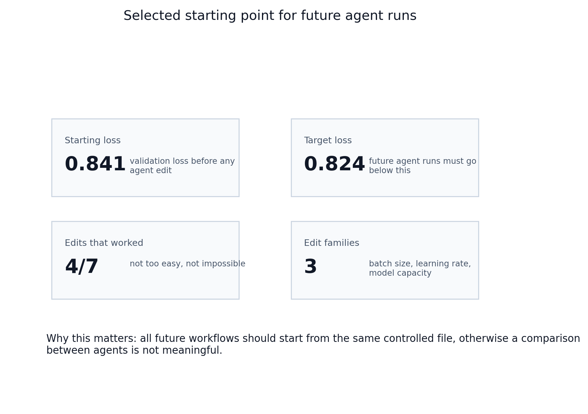
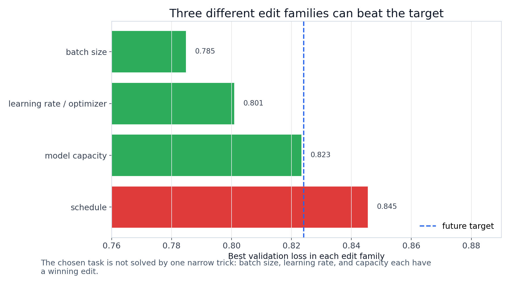

# Starting Model Calibration

**Status**: Active
**Date**: April 14, 2026
**Purpose**: choose one controlled `autoresearch/train.py` starting point before
comparing agent workflows.

## Why This Exists

Future experiments ask whether different agent workflows can improve a small ML
training script. For that comparison to mean anything, every workflow must start
from the same `train.py`.

The starting point cannot be arbitrary:

- if it is already too good, agents have little room to improve it;
- if it is too broken, improvements are obvious and the task is too easy;
- if it is unstable, differences between agents may just be evaluator noise.

This study chooses a middle starting point: credible, reproducible, and still
improvable in more than one way.

## Task In One Sentence

An agent will edit `autoresearch/train.py`; the evaluator will train it for
1170 optimizer updates; the result is scored by validation loss.

Lower validation loss is better. In the logs this value is named `val_bpb`.

## What Was Run

This was not an agent experiment. A script applied predefined edits to candidate
starting files and measured what happened.

- **161** controlled evaluator runs.
- **4** screening passes.
- **585** and **1170** optimizer-update screens.
- Edits covered batch size, learning rate, model capacity, schedule, optimizer,
  and regularization.

Trial counts differ because each screen tested a different set of candidates and
edits. Comparisons therefore use **edit success rate**: successful edits divided
by tested edits.

## Result

The selected starting point is:

```text
human description: width 30, lower learning rate
internal id:        width30_lr_low
training length:   1170 optimizer updates
starting loss:     val_bpb = 0.841354
future target:     val_bpb <= 0.824
```

Why this one:

- 4 of 7 simple edits improved it;
- improvements came from 3 different edit families;
- some edits failed, so the task is not a free win;
- the starting file is still a plausible training setup, not an obviously
  damaged toy.

## How To Read The Figures


**Figure 1** explains the task. There is no separate `Q` metric in this report:
the quality score is validation loss, `val_bpb`, and lower is better.


**Figure 2** explains why the study uses 1170 optimizer updates. At 585 updates,
edits won too often, so that screen was mostly useful for debugging. The 1170
screen leaves useful improvements while preserving failures.


**Figure 3** compares candidate starting points. The selected one is in the
middle: not too hard, not too easy.


**Figure 4** shows the seven edits tested on the selected starting point. Green
bars beat the future target; red bars are useful failures.



**Figure 5** is the compact result card for presentations.



**Figure 6** shows that three independent edit families can beat the target:
batch size, learning rate, and model capacity.

## Selected `train.py` Settings

```text
DEPTH = 3
BASE_CHANNELS = 30
FC_HIDDEN = 128
OPTIMIZER = adam
LEARNING_RATE = 5e-4
WEIGHT_DECAY = 1e-4
DROPOUT_RATE = 0.0
USE_LR_SCHEDULE = False
BATCH_SIZE = 128
AUTOSEARCH_MAX_STEPS = 1170
```

## Edits That Beat The Target

| edit family | best edit | validation loss | improvement |
| --- | --- | ---: | ---: |
| Batch size | use batch size 256 | 0.784812 | 0.056542 |
| Learning rate / optimizer | raise learning rate to 0.0015 | 0.800896 | 0.040458 |
| Model capacity | make the model slightly wider | 0.823338 | 0.018016 |

## Useful Failed Edits

These failures matter because they show the task is not automatically solved by
any change.

| edit | family | validation loss | effect |
| --- | --- | ---: | --- |
| turn on learning-rate schedule | Schedule | 0.845433 | worse by 0.004079 |
| raise learning rate to 0.001 | Learning rate / optimizer | 0.847634 | worse by 0.006280 |
| switch optimizer to AdamW | Learning rate / optimizer | 0.878075 | worse by 0.036721 |

## Why Not 585 Updates

The 585-update screen was too easy: almost every reasonable edit improved the
model. That is useful for debugging, but weak for evaluating agent workflows.

At 1170 updates, the task still has real improvements available while retaining
negative controls.

## Next Step

Run a small agent pilot from this exact starting point:

```text
starting train.py: AUTOSEARCH_MAX_STEPS = 1170
success condition: val_bpb <= 0.824
evaluator: serialized when multiple agents share one machine
report separately: agent thinking time and evaluator training time
```

## Artifacts

- Summary table: `results/tables/baseline_summary.csv`
- Trial table: `results/tables/trial_results.csv`
- Machine-readable summary: `results/tables/baseline_headroom_summary.json`
- Figure generator: `../../scripts/plot_baseline_headroom.py`

Legacy note: the folder and raw tables still use historical names such as
`baseline_headroom`, `q3`, and `q_star`. In this README, those mean starting
model calibration and target validation loss.
