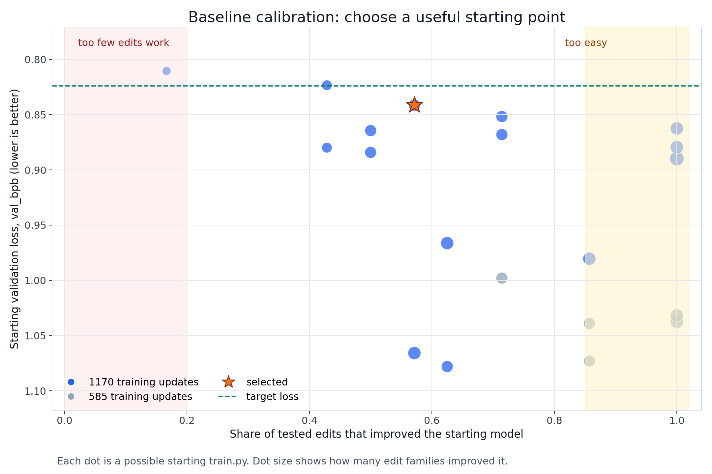
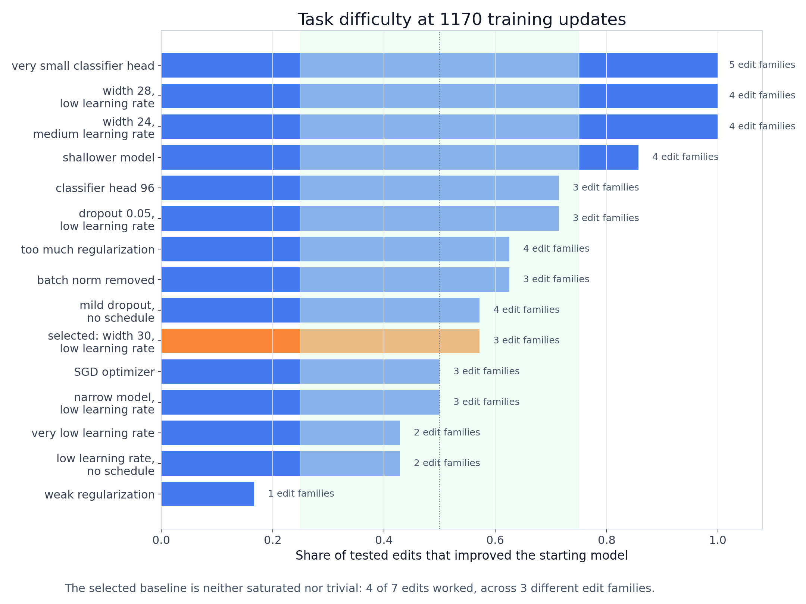
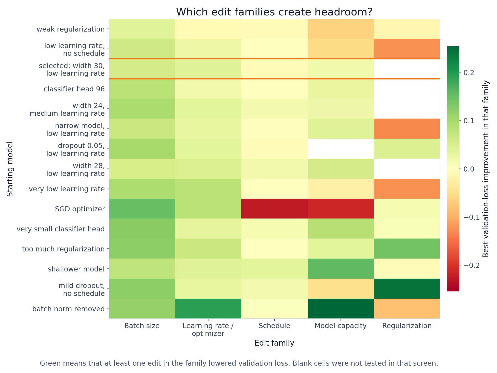
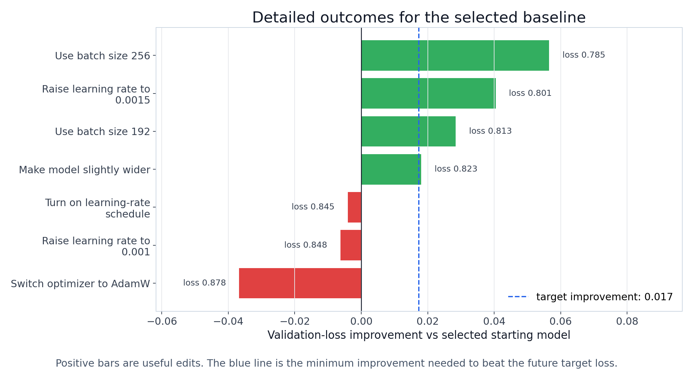

# Baseline Headroom Study

**Status**: Active
**Period**: April 14, 2026
**Objective**: Find a healthy but non-trivial AutoResearch baseline before running the reviewer-grade BP 2x2.

## Task Context

Future agents will edit `autoresearch/train.py`, run the training evaluator, and
try to lower `val_bpb`, the validation-loss metric reported by the script. Lower
`val_bpb` is better.

The target for later agent runs is `target_val_bpb = 0.824`. Older protocol
notes call this `q*`; it is just the validation-loss threshold an agent must
beat.

## Research Question

The next agent studies need a task that is neither trivial nor saturated. If the
starting model is too weak, almost any edit wins. If it is too strong, no edit
works and the agent comparison measures noise.

**Can we choose a starting `train.py` where several distinct edit families can
improve validation loss, without making the task trivially easy?**

This study is deliberately non-agentic: a script applied predefined edits, not
an AI agent choosing what to try.

## What Changed

The baseline headroom study added a controlled baseline-headroom calibration tool:

- fixed-step evaluator support with `AUTOSEARCH_MAX_STEPS`;
- isolated workspaces for every baseline/edit trial;
- baseline and edit panels covering optimizer/LR, scheduler, capacity, regularization, and batch/data;
- JSON/CSV/Markdown outputs for calibration screens;
- reviewer-grade cost and hitting-time instrumentation from the preceding protocol work.

The working `autoresearch/train.py` baseline was updated to the selected candidate:

```text
DEPTH = 3
BASE_CHANNELS = 30
FC_HIDDEN = 128
OPTIMIZER = adam
LEARNING_RATE = 5e-4
WEIGHT_DECAY = 1e-4
DROPOUT_RATE = 0.0
USE_LR_SCHEDULE = False
BATCH_SIZE = 128
AUTOSEARCH_MAX_STEPS = 1170
```

## Experiments

| screen | training updates | trials | purpose |
| --- | ---: | ---: | --- |
| `baseline_headroom_calibration_fixed1170` | 1170 | 43 | default healthy-mistuned baseline screen |
| `baseline_headroom_calibration_extended_targeted_fixed1170` | 1170 | 38 | broader model / optimizer / regularization screen |
| `baseline_refinement_custom_fixed585` | 585 | 40 | shorter-step refinement screen |
| `baseline_refinement_custom_fixed1170` | 1170 | 40 | intermediate-width / head / mild-dropout refinement |

Total controlled evaluations summarized here: **161**.

Trial counts differ because each screen tested a different candidate/edit panel,
and no-op edits were skipped. Compare normalized edit win rate
(`successful_edits / tested_edits`), not raw trial count.

## Key Figures



**Figure 1**: each dot is a candidate starting `train.py`. The x-axis shows the
normalized edit success rate; the y-axis shows starting validation loss. The
orange star is the chosen starting model.



**Figure 2**: 1170-update candidates ranked by normalized edit success rate.
The selected model is useful because 4 of 7 tested edits worked across 3 edit
families: enough headroom, but not a free win.



**Figure 3**: which edit families helped which starting model. Green means an
edit family lowered validation loss; red means it hurt.



**Figure 4**: the seven simple edits tested on the selected starting model.
Positive bars lower validation loss. The blue dashed line is the improvement
needed to beat `target_val_bpb = 0.824`.

## Decision

Recommended baseline:

```text
starting_model = width 30, lower learning rate
internal_id = width30_lr_low
run = refinement_fixed1170
starting val_bpb = 0.841354
target_val_bpb = 0.824  # old shorthand: q*
```

Winning categories:

| category | best trial | best val_bpb | improvement |
| --- | --- | ---: | ---: |
| data_batch | `width30_lr_low__data_batch__batch256` | 0.784812 | 0.056542 |
| normalization_capacity | `width30_lr_low__normalization_capacity__width32` | 0.823338 | 0.018016 |
| optimizer_lr | `width30_lr_low__optimizer_lr__lr_1p5e3` | 0.800896 | 0.040458 |

Negative / near-negative controls:

| trial | category | val_bpb | delta vs baseline |
| --- | --- | ---: | ---: |
| `width30_lr_low__scheduler__schedule_on` | scheduler | 0.845433 | -0.004079 |

## Candidate Comparison

| baseline | screen | training updates | baseline val_bpb | raw wins | winning categories | target loss |
| --- | --- | ---: | ---: | ---: | --- | ---: |
| narrow_lr_low | default_fixed1170 | 1170 | 0.864447 | 4/8 | data_batch, normalization_capacity, optimizer_lr | 0.832826 |
| sgd_baseline | extended_fixed1170 | 1170 | 0.884132 | 3/6 | data_batch, optimizer_lr, regularization | 0.872697 |
| width30_lr_low | refinement_fixed1170 | 1170 | 0.841354 | 4/7 | data_batch, normalization_capacity, optimizer_lr | 0.823338 |
| mild_dropout_no_schedule | extended_fixed1170 | 1170 | 1.065839 | 4/7 | data_batch, optimizer_lr, optimizer_scheduler, regularization | 1.035120 |
| overregularized_lr_low | default_fixed1170 | 1170 | 0.966298 | 5/8 | data_batch, normalization_capacity, optimizer_lr, regularization | 0.899594 |
| no_batchnorm_lr_low | default_fixed1170 | 1170 | 1.078067 | 5/8 | data_batch, normalization_capacity, optimizer_lr | 0.963829 |
| fc96_lr_low | refinement_fixed1170 | 1170 | 0.851718 | 5/7 | data_batch, normalization_capacity, optimizer_lr | 0.834426 |
| dropout005_lr_low | refinement_fixed1170 | 1170 | 0.868005 | 5/7 | data_batch, optimizer_lr, regularization | 0.830335 |

## Why 1170 Updates

The 585-update screens created broad headroom, but almost every reasonable edit
won. That is useful for debugging, but weak for confirmatory architecture
claims. At 1170 updates, the task remains learnable while retaining more
negative controls.

## Next Step

Run a small agentic pilot on `width30_lr_low` before the full 2x2:

```text
fixed-step evaluator
AUTOSEARCH_MAX_STEPS = 1170
serialized evaluator
target_val_bpb = 0.824
separate agent_deliberation_wall_time and evaluator_wall_time
true independent replicates
```

## Artifacts

- Summary table: `tables/baseline_summary.csv`
- Trial table: `tables/trial_results.csv`
- Machine-readable summary: `tables/baseline_headroom_summary.json`
- Legacy raw-table note: the `q3` column means the target loss implied by the
  third winning edit family. In prose, this summary calls the selected
  threshold `target_val_bpb`.
- Source calibration reports remain under `runs/baseline_*`.
