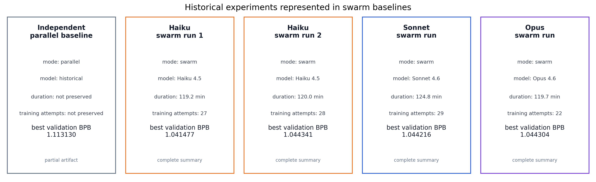
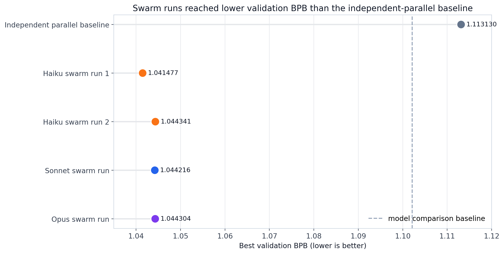
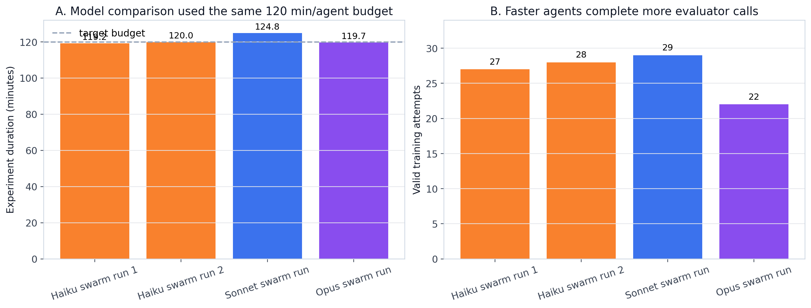
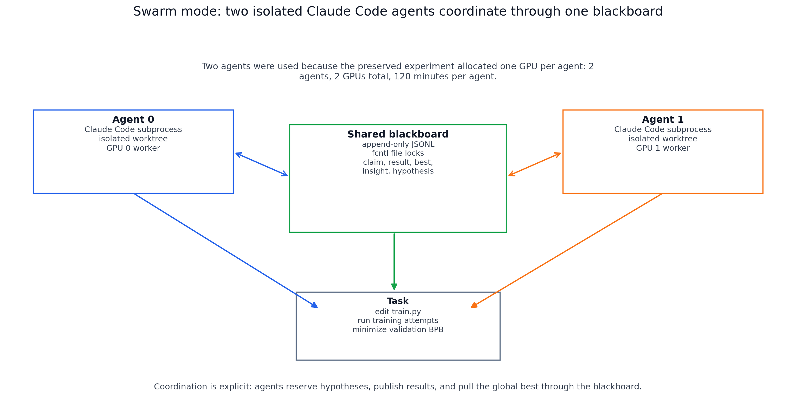
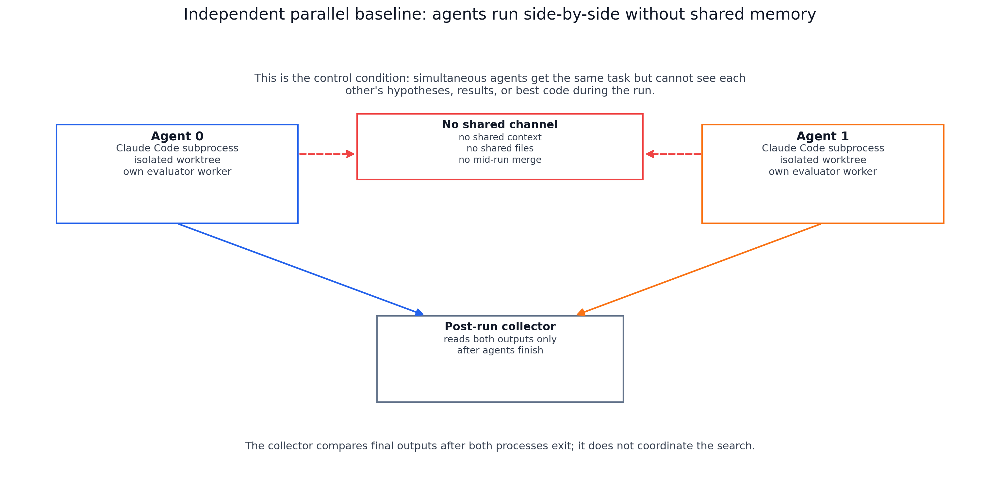

# Swarm Baselines

**Status**: historical context study
**Period**: April 2026
**Purpose**: preserve early evidence that blackboard-style coordination can make
two autonomous agents search better than independent parallel agents.

This study is not a normalized BP `d00` / `d10` / `d01` / `d11` experiment. It
uses an older, stronger swarm protocol: two agents run in isolated workspaces
but coordinate through a shared blackboard with `claim`, `result`, `best`,
`insight`, and `hypothesis` entries.

## What Was Being Tested

The task was an AutoResearch optimization loop. Each agent used Claude Code to
edit `train.py`, launch training attempts, observe validation BPB, and keep
searching for a lower validation BPB. Lower `val_bpb` is better.

The preserved swarm model-comparison runs used:

- 2 agents;
- 1 GPU per agent, 2 GPUs total;
- 120 minutes per agent;
- 300 seconds per training attempt;
- a shared blackboard in swarm mode.

Two agents were used because this was the smallest coordinated setup that could
test cross-agent memory while staying within the preserved compute envelope of
2 GPUs for roughly 2 hours.

## Clean Experiment Names

| Canonical name | Original ID | Role | Preserved evidence |
| --- | --- | --- | --- |
| `independent_parallel_baseline` | `experiment_exp_20260401_013535` | control condition with two independent agents and no shared memory | summary only |
| `haiku_swarm_run_1` | `experiment_exp_20260405_022850` | first Haiku 4.5 two-agent swarm run | deep-dive figures, model-comparison row, swarm-vs-parallel row |
| `haiku_swarm_run_2` | `experiment_exp_20260405_124604` | second Haiku 4.5 two-agent swarm run | model-comparison row, swarm-vs-parallel row |
| `sonnet_swarm_run` | `experiment_exp_20260406_024115` | Sonnet 4.6 two-agent swarm run | model-comparison row |
| `opus_swarm_run` | `experiment_exp_20260406_044120` | Opus 4.6 two-agent swarm run | model-comparison row |

There are five unique experiment runs represented here. The often-mentioned
`106 successful runs` are not 106 experiments. They are 106 successful training
attempts inside the four swarm model-comparison experiments:

| Experiment | Model | Duration | Successful training attempts | Best `val_bpb` |
| --- | --- | ---: | ---: | ---: |
| `haiku_swarm_run_1` | Haiku 4.5 | 119.2 min | 27 | 1.041477 |
| `haiku_swarm_run_2` | Haiku 4.5 | 120.0 min | 28 | 1.044341 |
| `sonnet_swarm_run` | Sonnet 4.6 | 124.8 min | 29 | 1.044216 |
| `opus_swarm_run` | Opus 4.6 | 119.7 min | 22 | 1.044304 |

The model-comparison durations are comparable: all were run with the same
120-minute-per-agent budget. The preserved Sonnet artifact ran about 4.8
minutes over the nominal target; this is small enough for a historical comparison
but should be normalized in future confirmatory runs.

The independent-parallel baseline is less complete: the preserved summary keeps
agent-level and system-level best BPB, but not duration or training-attempt
counts.

## Main Results

1. **Swarm coordination beat independent parallelization in the preserved
   comparison.** The independent-parallel baseline reached system-best
   `val_bpb = 1.113130`; the two Haiku swarm runs reached `1.041477` and
   `1.044341`.

2. **Model choice mattered less than iteration speed.** Haiku, Sonnet, and Opus
   all ended in a tight `val_bpb` band around `1.041-1.044`. Haiku had the best
   value and the only replicated model result; Opus was slower and completed
   fewer training attempts.

3. **The useful mechanism is the blackboard, not hidden shared context.** Agents
   were separate Claude Code subprocesses with separate worktrees. Coordination
   happened because both could read and write a locked JSONL blackboard and
   explicitly publish hypotheses, results, and best code.

## Current Figures

**Figure 1**: the five preserved experiment runs with readable names. The
parallel baseline is marked as a partial artifact because its raw run directory
was not preserved here.

**Figure 2**: swarm runs reached substantially lower validation BPB than the
independent-parallel baseline.

**Figure 3**: the four model-comparison swarm runs used the same 120-minute
agent budget; faster agents completed more training attempts.

**Figure 4**: in swarm mode, both agents have isolated workspaces but coordinate
through a shared JSONL blackboard protected by file locks.

**Figure 5**: in the independent-parallel baseline, agents run side-by-side with
no shared context, no shared files, and no mid-run merge.

## How Agents Were Spawned

The current implementation runs each agent as an isolated Python subprocess.
Inside that subprocess, the agent is invoked through the Claude Code CLI using
`claude --print`.

- Independent parallel mode creates one isolated workspace per agent, launches
  all agents simultaneously, and collects results only after all agents finish.
- Swarm mode also creates one isolated workspace per agent, but additionally
  installs `coordinator.py`, `coordinator_local.py`, prompt files, and a
  `.swarm_env` pointing to the shared blackboard.
- The shared blackboard is an append-only JSONL file. Writes use exclusive
  `fcntl` locks; reads use shared locks. This prevents corruption when multiple
  agent processes write concurrently.

Useful implementation references:

- parallel process spawning: `src/agentops_lab/orchestrator.py`;
- independent agent subprocess wrapper:
  `src/agentops_lab/agents/isolated_agent_process.py`;
- Claude Code invocation: `src/agentops_lab/swarm/claude_agent_runner.py`;
- swarm orchestrator: `src/agentops_lab/swarm/swarm_orchestrator.py`;
- blackboard implementation: `src/agentops_lab/swarm/shared_memory.py`;
- workspace blackboard tool installation: `src/agentops_lab/swarm/workspace.py`.

## File Map

| Path | Meaning |
| --- | --- |
| `results/figures/` | current public figures generated by `scripts/plot_swarm_baselines.py` |
| `results/analysis/haiku_swarm_run_1_deep_dive/` | visual deep dive into `haiku_swarm_run_1` |
| `results/analysis/model_comparison/` | Haiku/Sonnet/Opus model comparison artifacts |
| `results/analysis/swarm_vs_independent_parallel/` | comparison between independent parallel baseline and Haiku swarm runs |
| `results/analysis/analyze_swarm.py` | archived script for analyzing one raw swarm run |

## Completeness

This is a strong historical evidence bundle, but not a complete reproducibility
bundle. The curated summaries, CSV/JSON result tables, scripts, and figures are
preserved. The raw `results/swarm/runs/` directories were not present when the
artifacts were moved, so some scripts document provenance but cannot be rerun
inside this folder without restoring those raw runs.

Treat the result as design evidence for blackboard coordination, not as a final
confirmatory benchmark.
